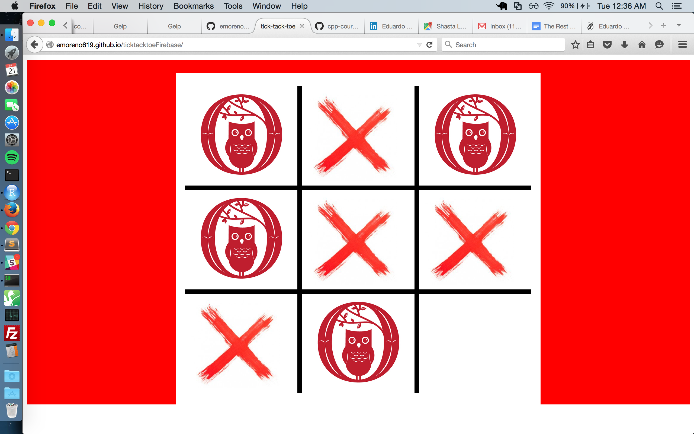

# ticktacktoeFirebase

[Link to this app in action](http://emoreno619.github.io/ticktacktoeFirebase/)

*This is a simple JS project that though not 100% bug-free, was built in two days during my 4th week of Javascript.*

This app allows two players to play tic-tac-toe in real time on different devices (or a single device). It was my first interaction with websockets and Firebase. Going forward bugs include limiting a game session to two players, stricter logic on which player's turn it is, user login, etc.
